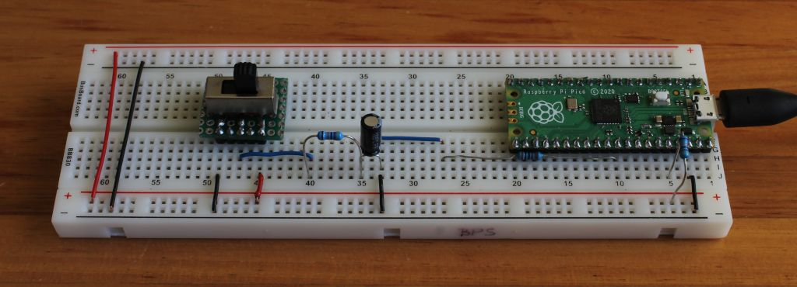
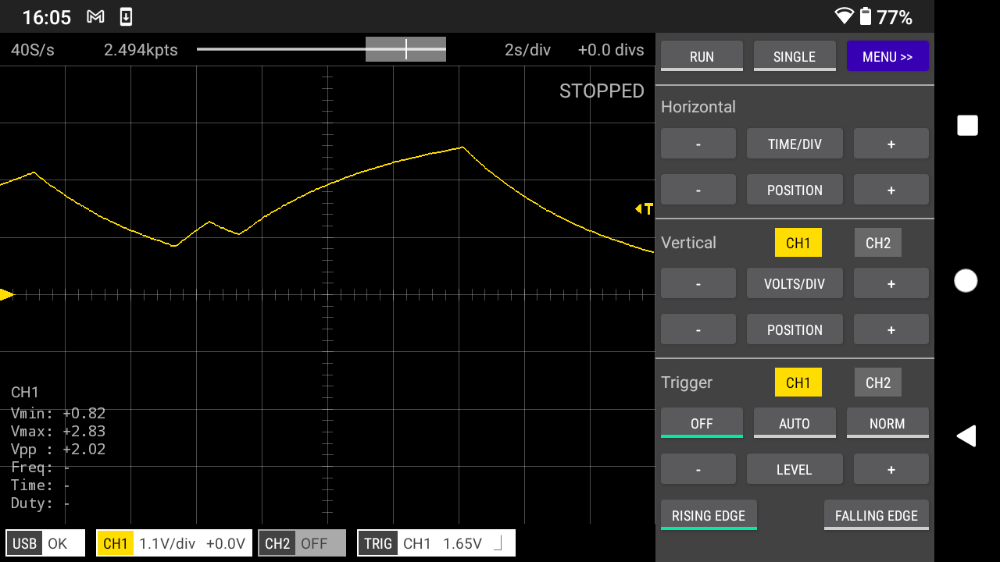
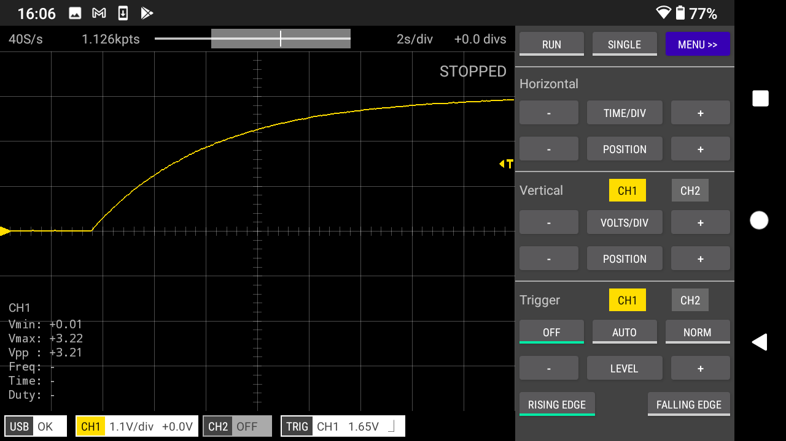
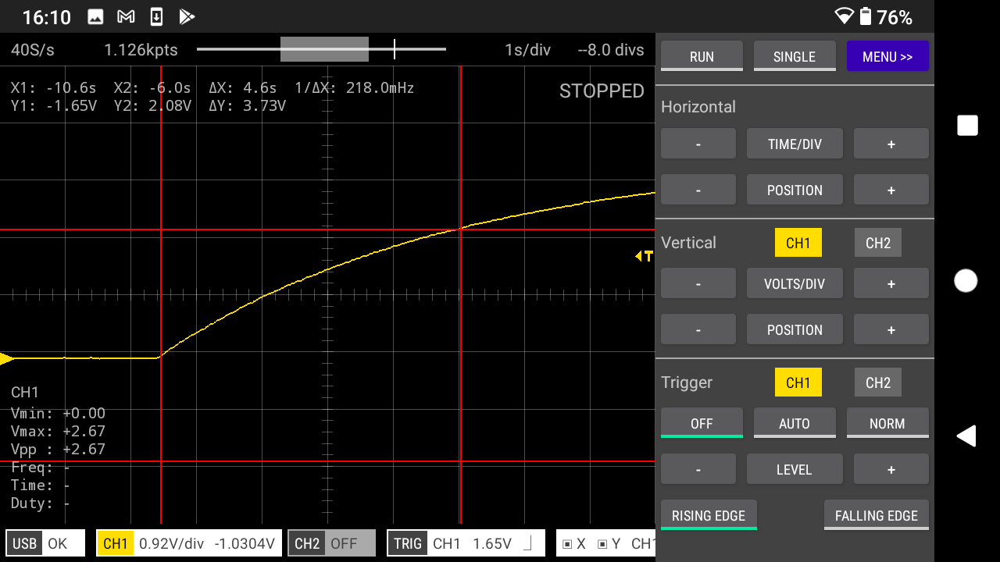

# Capacitor charging and discharging - Roll Mode

In this experiment we'll view in real time the change in voltage across a capacitor in an RC circuit that has a time constant of approximately 4.7 seconds. This will demonstrate the use of the oscilloscope roll mode and cursors.

## Background reading
https://www.allaboutcircuits.com/textbook/direct-current/chpt-16/capacitor-transient-response/    
https://www.allaboutcircuits.com/textbook/experiments/chpt-3/capacitor-charging-and-discharging/

 

## What is Roll Mode?
Roll mode is a method of displaying acquired waveform data without waiting for the complete waveform record. For example, if Time/Div is set to 1 second and roll mode wasn’t available, it would take 10 seconds to fill the waveform record. But using roll mode, the oscilloscope will immediately begin displaying results rather than waiting the full 10 seconds. Scoppy automatically enters roll mode when large values for Time/div are selected. When the trigger mode is set to AUTO or NORMAL the display window will be in the center of the sample record. This means that newly aquired data can take a while to become visible. By setting the trigger mode to OFF, Scoppy will display the most recent data in the sample record. This is what we want for this experiment because we want to see the voltage change across the capacitor in real time.

 

## Schematic

> Resistors Radc and Rpower are optional. Radc provides some protection to the Pico in case a voltage higher than 3.3V is applied to the ADC pin. Rpower prevents a direct
short in case there is an error in wiring up the circuit.

 

## Example breadboard layout

 

## Experiment instructions
### Assemble the circuit
* Assemble the circuit except for the Radc resistor. The ADC pins are not fault tolerant and so voltage should not be applied when the Pico is not powered up (ie. IOVDD is 0V). See 5.2.2.1 of the RP2040 datasheet.
* Move the switch to the 'discharge' position.   
* Connect the Pico to your Android device.   
* Insert the Radc resistor into the circuit.

### Configure the oscilloscope
* Set the trigger mode to OFF
* Set the Time/Div to 2 seconds
* Tap Run

### Charge and then discharge capacitor
* Move the switch to charge position
* When voltage is near 3.3V, move switch to discharge position
* Repeat until you get bored with it!

### Prepare to measure the time constant
* Discharge the cap until voltage is near 0
* Move the switch to the charge position
* When the voltage is near 3.3V, tap Stop

### Measure the time constant using cursors
* Tap the MENU button (near the top-right of the screen) and tap CURSORS.
* Move the horizontal cursors so that one of them is at 0V and the other at approx 63% of the input voltage (3.3V * 0.63 = 2.079V). The voltage levels of the cursors can be seen at the top left of the screen.
* Now move the vertical cursors so that one of them is at the point where the voltage begins to rise and the other so it intersects the upper cursor when that cursor intersects the voltage curve.
* Now read the time difference of the vertical cursors. Hopefully it should equal the time constant (RC) of the circuit. You might want to zoom in horizontally and vertically to make more precise measurements.
* The same can be done for the discharging the capacitor.

## Tips
When in Run mode you'll notice that zooming horizontally (changing the Time/Div) will sometimes cause the screen to clear and then start re-drawing. This is because Scoppy automatically changes the sample rate as you zoom - and when the sample rate changes Scoppy clears the current sample record. At lower Time/Div settings this is not a problem because each screenfull of samples only takes a short amount of time to aquire. At higher Time/Div settings this can be annoying. To get around this problem you can either simply hit stop before zooming or [select a fixed sample rate](https://oscilloscope.fhdm.xyz/app-help/Sample-Rate) by tapping the sample rate at the top left of the screen.

## Links
[Scoppy documentation](https://oscilloscope.fhdm.xyz/)